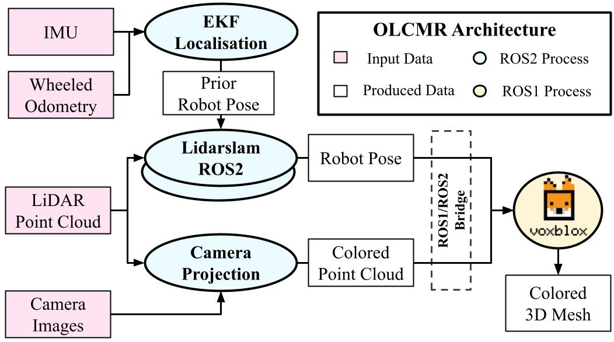

# Lidar-based Online Localisation and Colored Mesh Reconstruction ROS2/ROS1 Architecture
  
This repository contains a hybrid ROS2/ROS1 architecture for LiDAR based SLAM and real-time 3D colored mesh reconstruction using TSDF for ground exploration robots. 

# Publication

If you are using this code, please cite: 

- Q. Serdel, C. Grand, J. Marzat and J. Moras, [**Online Localisation and Colored Mesh Reconstruction Architecture for 3D Visual Feedback in Robotic Exploration Missions**](https://arxiv.org/abs/2207.10489). 2022 IEEE/RSJ International Conference on Intelligent Robots and Systems (IROS).

 ```bibtex
@InProceedings{9981137,
  author={Serdel, Quentin and Grand, Christophe and Marzat, Julien and Moras, Julien},
  booktitle={2022 IEEE/RSJ International Conference on Intelligent Robots and Systems (IROS)}, 
  title={Online Localisation and Colored Mesh Reconstruction Architecture for 3D Visual Feedback in Robotic Exploration Missions}, 
  year={2022},
  volume={},
  number={},
  pages={8690-8697},
  doi={10.1109/IROS47612.2022.9981137}}
 }
```

# Architecture Overview

The robot estimates its localisation and builds a global map of its environment in the form of a LiDAR point cloud through the implementation of the [lidarslam_ros2](https://github.com/rsasaki0109/lidarslam_ros2) SLAM architecture on ROS2 from [#rsasaki0109](https://github.com/rsasaki0109), using an EKF fusion between wheeled odometry and IMU measurements as localisation prior.

Coloration of the LiDAR point cloud is performed with RGB camera images geometric projection, using their intrinsic and extrinsic parameters estimated with the ROS package [Kalibr](https://github.com/ethz-asl/kalibr) from [#ethz-asl](https://github.com/ethz-asl)

Online TSDF surface reconstruction is performed under ROS1 Noetic using the [Voxblox](https://github.com/ethz-asl/voxblox) package from [#ethz-asl](https://github.com/ethz-asl). Data transfert between ROS1 and ROS2 nodes is ensured by a [ROS1/ROS2 bridge](https://github.com/ros2/ros1_bridge).


The architecture has been evaluated on the Quad-Easy trajectory of the [2021 Newer College dataset](https://ori-drs.github.io/newer-college-dataset/multi-cam/).
The rosbag used for testing the architecture can be downloaded on the [Newer College dataset website](https://ori-drs.github.io/newer-college-dataset/download/)

\
***Figure : OLCMR architecture main components and data transport***

---

**Requirements :**
* Ubuntu 20.04
* ROS2 Galactic
* ROS1 Noetic 
* Rviz and Rviz2

A fork from [lidarslam_ros2](https://github.com/rsasaki0109/lidarslam_ros2) with minor adaptations is included as a git submodule.

# Installation

**Package dependencies :**

[ros1_bridge](https://github.com/ros2/ros1_bridge), 
[perception_pcl ros2](https://github.com/ros-perception/perception_pcl), 
[robot_localization ros2](https://github.com/cra-ros-pkg/robot_localization):
```bash
sudo apt install ros-galactic-ros1-bridge ros-galactic-perception-pcl ros-galactic-robot-localization
```
[g2o library](https://github.com/RainerKuemmerle/g2o) :

```bash
cd ~
git clone https://github.com/RainerKuemmerle/g2o.git
cd g2o
mkdir build
cd build`
cmake ../
make
sudo make install
```

**Clone and build repository :**

```bash
cd ~
git clone https://gitlab.com/stage-qserdel/olcmr --recurse-submodules
cd olcmr
source /opt/ros/galactic/setup.bash
colcon build --packages-skip scanmatcher graph_based_slam lidarslam
source install/setup.bash
colcon build --symlink-install
```

**Install Voxblox package**

Follow [Voxblox installation instructions](https://voxblox.readthedocs.io/en/latest/pages/Installation.html)
then move the custom voxblox launch files and rviz config from this package to voxblox_ros directory :
```bash
cp voxblox_files/* ~/<your_noetic_ws>/src/voxblox/voxblox_ros
```

# Running OLCMR With the Newer College dataset

***All the parameters of OLCMR components are located in the  folder, they are described in this folder's README file.***
The following instructions allow to run the complete OLCMR architecture on the Newer College dataset and on our experimental dataset.

***Terminal A (ROS1 : TSDF and Rviz1 launch) :***\
*Run the TSDF node and visualize the result with Rviz.*
```bash
source /opt/ros/noetic/setup.bash
source ~/<your_noetic_ws>/devel/setup.bash
roslaunch voxblox_ros newer_college_tsdf_colored.launch
```

***Terminal B (ROS2 launch) :***\
*Run the architecture with the example dataset and bridge to ROS1.*
```bash
source /opt/ros/noetic/setup.bash
source /opt/ros/galactic/setup.bash
source ~/olcmr/install/setup.bash
ros2 launch olcmr_pkg olcmr_newer_college.launch.py 
```

# Saving OLCMR outputs

* To save the resulting 3D mesh, type in a ROS1 sourced terminal :
```bash
rosservice call /voxblox_node/generate_mesh
``` 

* To save the SLAM pointcloud maps as ply files, type in a ROS2 sourced terminal:
```bash
ros2 run olcmr_pkg map_saver 
```

* To save the SLAM estimated trajectories as csv files, type in a ROS2 sourced terminal:
```bash
ros2 service call /data_saver/save_trajectories
```

# Results and evaluation

***Below videos show the real-time application of OLCMR on the Newer College dataset (left) and on our custom countryside dataset (right)*** 


SLAM estimated trajectories and CPU/RAM usage monitoring data can be found in the [results](results) folder. See this folder's README file for data plotting manual.

# Using your own dataset or running the architecture on your robot

All the launch parameters are located in the [template.yaml](src/olcmr_pkg/params/robot_configs/template.yaml) file.\
You can copy this file and modify the parameters to run the architecture on a custom dataset or directly on board your robot, see [the parameters README file](src/olcmr_pkg/params) for parameters description.\
You should also edit the [olcmr.launch.py](src/olcmr_pkg/launch/olcmr.launch.py) file to use your config file.

You will need at least a LiDAR and a mono or RGB camera. For the architecture to function optimally, multiple RGB cameras with overlapping FOV, an IMU and a wheeled or legged odometry source should also be used. You can also use any other localisation source as the SLAM prior.\ 
Camera calibration should be performed using [Kalibr](https://github.com/ethz-asl/kalibr). 